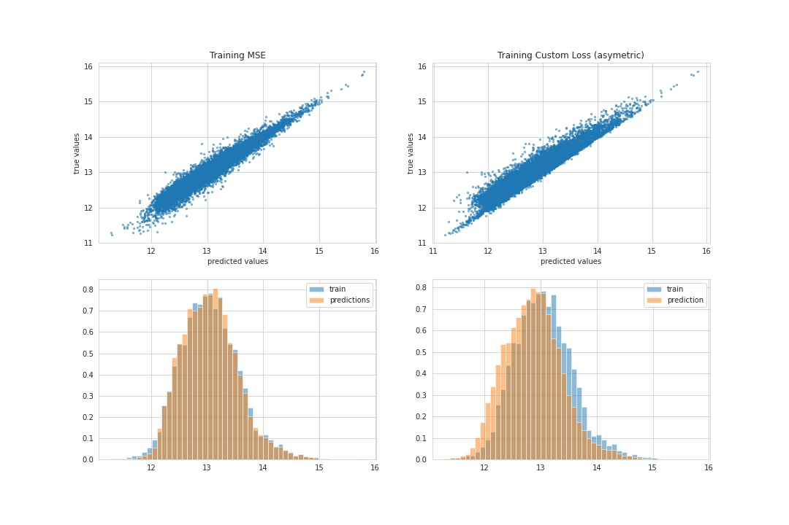

# This Repository contains several Notebooks associated with articles

**01_regression_xgboost.ipynb:** A regression model is trained predicting house prices for King County using XGBoost. 
The data can be found on [Kaggle](https://www.kaggle.com/datasets/harlfoxem/housesalesprediction). 
After some preprocessing the model is fit using mean squared error already implemented in the XGBoost package.

## Loss Functions in XGBoost and how to customize them
This notebook contains an explanation how to customize loss function using XGBoost. The article can be found on [medium](https://medium.com/@pumalinML/loss-functions-in-xgboost-c89885b57346)

**02_custom_loss_xgboost.ipynb:** The model from the first notebook is used to explore different loss functions. 
It is explained how we customize the loss in XGBoost showing several examples.

*The effect of different loss functions*

## Getting started with mlflow Experiment tracking - using a local folder and sqlite
**03_mlflow.ipynb:** In this notebook we learn how to use mlflow or experiment tracking, when results are stored in a local folder or a sqlite database. The article can be found on [medium](https://medium.com/@pumalinML/getting-started-with-mlflow-tracking-46a0089d6a73)

## Easy analyze your Data and ML model using Evidently AI
**04_evidently.ipynb:** In this notebook we consider the regression problem of predicting house prices and explore how we can use Evidently AI dashboards and profiles to monitor our data and model. The article can be found on [medium](https://medium.com/@pumalinML/easy-analysis-of-your-data-and-ml-model-using-evidently-ai-830ef0c1c4fd)

## Decision Trees for Classification - Complete Example
**05_decision_trees_classification.ipynb:** An introduction to Decision Trees for  Classification using a simplied, but complete example. The article can be found in [Towards Data Science / Medium](https://towardsdatascience.com/decision-trees-for-classification-complete-example-d0bc17fcf1c2)

## Introduction to OyTorch
**06_pytorch_introduction.ipynb:** An introduction to the Deep Learning Workflow in PyTorch with a concrete example. 
